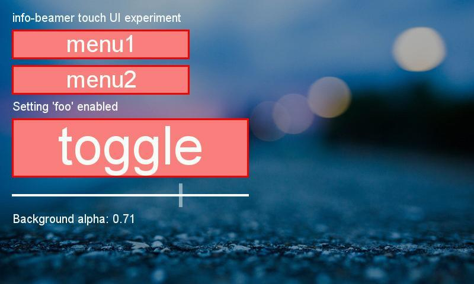

# info-beamer touch UI experiments



This repository shows how a touch interface running
on info-beamer hosted might work. Right now it's quite
ugly and there are only three widgets implemented. If you're
able to ignore that, you might find some interesting concepts
used in the experiment. You can play around with this package
right now:

[](https://info-beamer.com/use?url=https://github.com/info-beamer/package-touch-ui-experiments)

## Immediate mode GUI

Graphical user interfaces libaries all expect you to create
widgets, place them, manage their lifecycle, hide and show
them at the correct time and handle their events. 

Immediate mode GUIs make this a bit easier as you directly
write and handle events where they happen. Here's an example:


```lua
-- define button and its state
local btn = {
    text = "toggle";
}

-- using it later is as simple as
if ui.button(btn, layout.row(400, 100)).clicked then
    enable_foo = not enable_foo
end
```

If you need not conditionally show interface elements just
use them inside `if`. So you don't need to explicitly show/hide
interface elements. Instead you call or don't call them:

```lua
if enable_foo then
    ui.label({
        text = string.format("Background alpha: %.2f", background_alpha.value)
    }, layout.row(760, 20))
end
```

## Coroutine and tail-called based flow

Usually when you create interfaces with multiple different pages
you have to keep the state of where your user is somewhere. This
might be in variables (e.g. `current_page = pages.SETTINGS` or similar).
This experiments uses coroutines combined with the Lua tail-call
feature instead to make things even easier:

```lua
function main_menu()
    local child_btn = {
        text = "Goto child menu";
    }
    while ui.loop() do
        if ui.button(child_btn, layout.row(300, 50)).clicked then
            return child_menu()
        end
    end
end

function child_menu()
    local main_btn = {
        text = "Goto back to main menu";
    }
    while ui.loop() do
        if ui.button(main_btn, layout.row(300, 50)).clicked then
            return main_menu()
        end
    end
end

ui = UI{
    entry = main_menu;
}

function node.render()
    layout.reset(20, 20, 20, 10)
    ui.run() -- show current user interface
end
```

This is example code that shows a button to enter a "sub menu" and
from there return to the "main menu". Altough both `main_menu` and
`child_menu` might all each other indefinitely, thanks to the 
[tail call optimization](https://www.lua.org/pil/6.3.html) this
doesn't result in a stack overflow.

Additionally both menus seems to be causing an endless while loop.
Under the hood, the [coroutine feature of Lua](https://www.lua.org/pil/9.html)
is used. `ui.run` resumes the coroutine started at `main_menu` and
`ui.loop` yields from the coroutine back to `ui.run`. Together this
creates the illusion of an endlessly running UI that can immediately
respond to (user) input.

## Building widgets

Creating new widgets should be easy as well. Here's how a slider
looks like at the moment.

```lua
local function slider(ui, state, x1, y1, x2, y2)
    state = ui.get_state(state)
    local w = x2 - x1
    local cy = y1 + (y2 - y1) / 2

    local value = state.value or 0
    local mode = state.mode or "idle"
    local before = value

    if mode == "idle" and ui.touched(x1, y1, x2, y2) then
        mode = "change"
    elseif mode == "change" and not ui.touched() then
        mode = "idle"
    end

    if mode == "change" then
        local x, y = ui.touch_pos()
        value = clamp(0, 1, (x - x1) / w)
    end

    white:draw(x1, cy-2, x2, cy+2)
    local x = x1 + w * value
    white:draw(x-3, y1, x+3, y2, .5)

    state.mode = mode
    state.value = value
    state.changed = value ~= before
    return state
end
```

Basically all widgets right now follow the same idea:

```lua
local function slider(ui, state, x1, y1, x2, y2)
    -- get current widget state
    -- modify current widget state
    -- draw the widgets
    -- update and return widget state
end
```

## Playing around with this code

You can import this code into your info-beamer hosted account by clicking this
button:

[](https://info-beamer.com/use?url=https://github.com/info-beamer/package-touch-ui-experiments)

You need a supported touch device. Right now that's either the 
[official 7" Pi display](https://www.raspberrypi.org/products/raspberry-pi-touch-display/) or
the
[CM3 PANEL](https://www.acmesystems.it/CM3-PANEL).

If you want to edit and extend this code, you should use the
[dev-mode](https://github.com/info-beamer/package-sdk/tree/master/dev-mode)
feature so you can directly see changes you make to the code on your info-beamer
hosted device.
